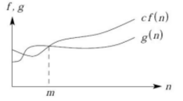

# Análise de complexidade (AP 02)
> Leonardo Osvaldo Soares de Moura Silva - 2ºP Eng. Computação

## Algorítmos

Para podermos analisar a complexidade de um algorítimo, primeiro precisamos entender o que é um algorítimo.

Não existe uma definição formal e geral de algorítimo, pois é algo específico de cada problema, e ainda podem existir multiplas soluções para o mesmo caso.

Considerando as definições:

> ### `Computação`  
> Conjunto das regras e procedimentos lógicos perfeitamente definidos que levam à solução de um problema em um número finito de etapas.

> ### `Matemática`
> Sequência finita de regras, raciocínios ou operações que, aplicada a um número finito de dados, permite solucionar classes semelhantes de problemas.

Podemos então, definir que, um algorítimo é um conjunto lógico de procedimentos para levar à solução de um problema.

Esse conjunto lógico de procedimentos não necessáriamente precisa ser um código em alguma linguagem.

Podemos expressar algorítimos de diversas maneiras
- Linguagem natural
- Pseudo-código
- Diagramas
- Linguagens de programação

> Exemplos:

~~~
Entrada: Conjunto de números inteiros A.
Saída: Maior elemento desse conjunto.

Uma variavel m recebe o primeiro elemento de A.
Para todos os outros elementos de Ai de A:
    Se o elemento Ai for maior que m:
        m recebe Ai.
Retorna o valor de m.
~~~
~~~C
int max(int[] a, int n){
    int temp;
    temp = a[0];
    for(int i = 1; i < n; i++){
        if(temp < a[i]){
            tmep = a[i];
        }
    }
    return temp;
}
~~~

## Análise matemática

> Qual a importancia de fazermos uma análise matemática de um algorítimo?

A importância é simples, porém a análise é complexa.

Como definido anteriormente, para um problema, podem existir diversas soluções, devemos então, definir qual é a melhor.

Devemos considerar um tópico para definir o melhor algorítimo
- Tempo de execução
- Custo computacional
- Soluções com maior qualidade

Podemos analisar um código ou um trecho de código e transformar em uma função de _n_:

~~~Java
for(int i = 0; i < n; i++){
    lista();
}
~~~

Esse trecho de código pode ser representado por complexidade pela função

> f(n) = n;

A taxa de crescimento é representada pela letra _n_, 

Esse _n_ representa o numero de vezes que a função `lista()` foi chamada, essa função, seria, por exemplo, uma função de grande custo computacional, logo ela é a mais importante da nossa análise.

Agora analise esse trecho de código:

~~~Java
if(a < b) {
    for(int i = 0; i < n; i++){
        lista();
    }
} else {
    lista();
}
~~~

Qual seria a função que representa esse trecho de código?

Como temos dois casos, e eles não dependem do nosso _n_, podemos representar que a função seria

>f(n) = n ou f(n) = 1

Definiremos esse cenário com três casos:

> ### Melhor caso
> Menor "tempo de execução" para todas as entradas possíveis de tamanho n

> ### Pior caso
> Maior "tempo de execução" para todas as entradas possíveis

> ### Caso médio (Esperado)
> Média dos tempos de execução para todas as entradas possíveis

Logo nesse trecho de código temos:
#### Melhor caso 
> f(n) = 1
#### Pior caso
> f(n) = n
#### Caso médio
> f(n) = (1 + n) / 2

Para alguns outros algorítimos mais complexos, teremos por exemplo:
>Algoritmo 1: f1(n) = 2n² + 5n operações

>Algoritmo 2: f2(n) = 500n + 4000 operações

Para definir qual é o "melhor" algoritimo temos que considerar sempre o pior caso (n → ∞). 

Nesse caso, o algoritimo 1 é pior para n → ∞, logo, o algoritimo 2 é "melhor".

## Comportamento assintótico

Uma função f(n) domina assintoticamente outra função g(n) se existem duas constantes positivas c e m tais que, para n >= m, temos `|g(n)| <= c . |f(n)|`

Ou seja, para números grandes `c.f(n)` será sempre maior que `g(n)`, para alguma constante c

    

No exemplo anterior dos algoritimos 1 e 2:
>Algoritmo 1: f1(n) = 2n² + 5n operações

>Algoritmo 2: f2(n) = 500n + 4000 operações

A função do algorítimo 1 domina a função do algorítimo 2

## Notação `O`
A notação O é utilizada para definir a complexidade de um algoritimo, trocaremos o F(n) Por O

> F(n) = n --> O(n)

> F(n) = n² --> O(n²)

> Complexidade -> 1 / 2 / 5 / 1000 --> O(1)

> F(n) = lg(n) --> O( lg(n) )

### Definição por classes

Com as funções de complexidade de cada programa, podemos compará-los.

Com a notação O, podemos definir algorítimos por classes.

As classes mais comuns são (Melhor para pior):

- O(1) - Complexidade constante
> Eles têm o mesmo desempenho independente do valor de n

- O(log n) - Complexidade logarítmica
> São algoritimos que dividem o problema em outros menores na forma de divisão e conquista

- O(n) - Complexidade linear
> Nestes algoritmos, se dobrarmos n, o tempo de resposta também dobra

- O(n log n)
> São os mesmos algoritimos de complexidade logarítmica porém eles combinam as soluções

- O(n²) - Complexidade quadrática
> Nestes algoritmos, se dobramos n, o tempo de resposta se multiplica por 4

- O(n³) - Complexidade cúbica
> Nestes algoritmos, se dobramos n, o tempo de resposta se multiplica por 8

- O(2ⁿ) - Complexidade exponencial
>São os algoritimos que usam de força-bruta para resolver problemas que envolvem combinações

- O(n!) - Complexidade exponencial(Fatorial)
>São os algoritimos que usam de força-bruta para resolver problemas que envolvem permutações

### Comparação de classes

| Classe de complexidade |   _n_ = 10   |  _n_ = 20  |   _n_ = 30   |   _n_ = 40  |  _n_ = 50  |   _n_ = 60  |
|-----------------|:-------:|:-------:|:-------:|:-------:|:-------:|:-------:|
|
O(n)
| 0,00001 _s_ | 0,00002 _s_ | 0,00003  _s_| 0,00004 _s_ | 0,00005 _s_ | 0,00006 _s_ |
|
O(n²)
| 0,0001 _s_ | 0,0004 _s_ | 0,0009 _s_ | 0,0016 _s_ | 0,0025 _s_ | 0,0036 _s_ |
|
O(n³)
| 0,001 _s_ | 0,008 _s_ | 0,027 _s_ | 0,64 _s_ | 0,125 _s_ | 0,361 _s_ |
|
O(n⁵)
| 0,1 _s_ | 3,2 _s_ | 24,3 _s_ | 1,7 _min_ | 5,2 _min_ | 13 _min_ |
|
O(2ⁿ)
| 0,001 _s_ | 1 _s_ | 17,9 _min_ | 12,7 _dias_ | 35,7 _anos_ | 366 _séculos_ |
|
O(3ⁿ)
| 0,059 _s_ | 58 _min_ | 6,5 _anos_ | 3855 _séculos_ | 10⁸ _séculos_ | 10¹³ _séculos_ |

## Conclusão

Estudando a analise de complexidade de algoritmos e entendendo como realizar a análise matemática, é possível definir a classe do algoritimo e assim escolher o melhor algoritimo, que soluciona o mesmo problema, computacionalmente.